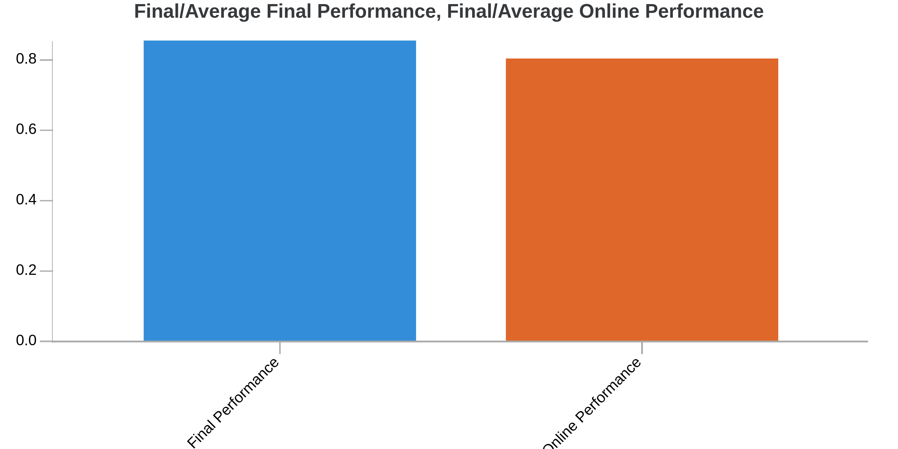
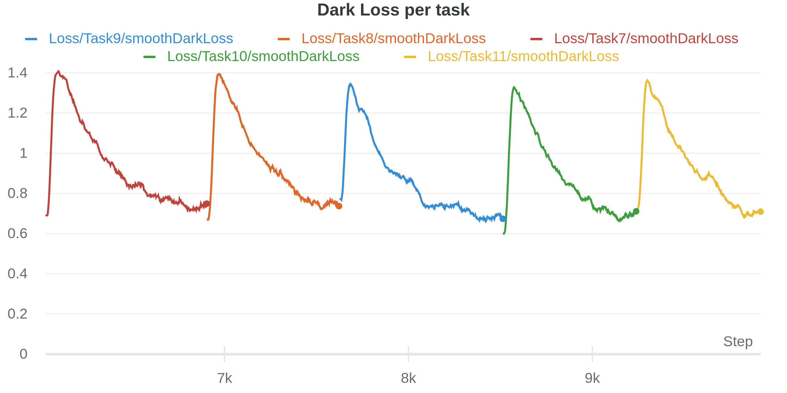

# cvpr-cl-challenge

entry for CL vision workshop under name Real-Deel https://eval.ai/web/challenges/challenge-page/829/overview

<details open="open">
  <summary>Table of Contents</summary>
  <ol>
    <li>
      <a href="#parameters">Parameters</a>
      <ul>
        <li><a href="#training">Training</a></li>
        <li><a href="#early-stopping">Early Stopping</a></li>
        <li><a href="#wandb">Wandb</a></li>
        <li><a href="#flags">Flags</a></li>
      </ul>
    </li>
    <li>
      <a href="#best-SL-submission">Getting Started with Best Command</a>
      <ul>
        <li><a href="#best-submission-command">Best Submission Command</a></li>
      </ul>
    </li>
    <li><a href="#best-run-plots">Plots of Best Run</a></li>
    <li><a href="#acknowledgements">Acknowledgements</a></li>
    <li><a href="#references">References</a></li>
  </ol>
</details>

# Parameters 

## Training
- --learning_rate : float Learning rate of the optimizer 
- --weight_decay : float L2 regularization coefficient.
- --max_epochs_per_task : int Maximum number of training epochs per task in SL and max number of training steps for RL. 
- --max_epochs_decay_per_task : float decay of max_epochs after each task
- --model_type : str model name to select from models in the models folder
- --optimizer : str optimizer name to select an optimizer
- --scheduler_name: str scheduler name that will work if scheduler flag enabled
- --batch_size: int. batch size used during training.
- --sl_nb_tasks: int. number of tasks for supervised learning track.
- --cl_method_name: str. method name as shown in methods/__init__.py
- --seed: int. seed for deterministic runs in pytorch
- --output_dir: str. output directory for data and wandb logs.

## Early stoppping

### on validation:    
--early_stop: bool 
- --early_stop_patience : int Number of epochs with increasing validation loss after which we stop training.
- --early_stop_decay_per_task : float decay of early stopping after each task
### on smooth dark training loss    --early_stop_train: bool = False
- --early_stop_train_patience: int = 60
## Wandb
- --wandb_logging : bool
- --wandb_api : str
- --wandb_entity : str
- --wandb_project : str
- --wandb_run_name : str

## Flags
- --debug_mode : bool enable debug mode for a fast dry run 
- --use_scheduler : bool use scheduler

# Best SL submission

## Best Submission Command
    Method = METHODS_MAPPING['der']
    hparams = Method.HParams(learning_rate=0.00034,
            max_epochs_per_task=7, max_epochs_decay_per_task=1.0,
            submission=True,
            buffer_size=6000, dark_coefficient=1.2,
            early_stop_train=True, early_stop_train_patience=45,
            bic=True
            )

main.py --cl_method_name=der --learning_rate=0.00034 --max_epochs_per_task=7 --max_epochs_decay_per_task=1.0 --submission=True --buffer_size=6000 --dark_coefficient=1.2 --early_stop_train --early_stop_train_patience=45 --bic

## Best Run Plots
| Metric      | Score |
| :------------- | :----------- |
|Final/Average Online Performance: | 0.80 |
|Final/Average Final Performance:| 0.86 |
|Final/Runtime (seconds):| 482|
|Final/CL Score: | 0.87|

<p align="center">






</p>

## Acknowledgements

* [Mostafa ElAraby](https://www.mostafaelaraby.com/)
* [Yann Pequignot](https://www.irif.fr/~pequignot/)

## References
```
[1]P. Buzzega, M. Boschini, A. Porrello, D. Abati, and S. Calderara, “Dark Experience for General Continual Learning: a Strong, Simple Baseline,” Apr. 2020, Accessed: Jun. 01, 2021. [Online]. Available: https://arxiv.org/abs/2004.07211v2
```

```
[2]P. Buzzega, M. Boschini, A. Porrello, and S. Calderara, “Rethinking Experience Replay: a Bag of Tricks for Continual Learning,” arXiv:2010.05595 [cs, stat], Oct. 2020, Accessed: Jul. 01, 2021. [Online]. Available: http://arxiv.org/abs/2010.05595
```

